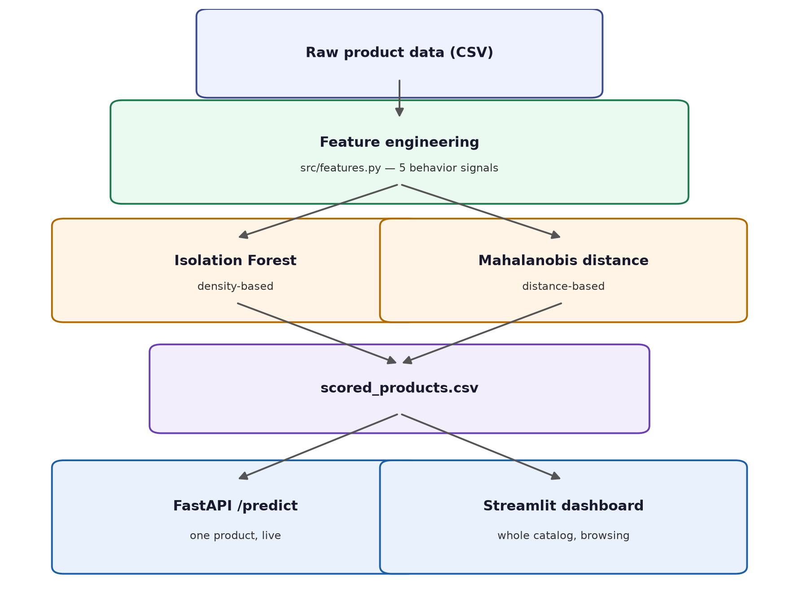
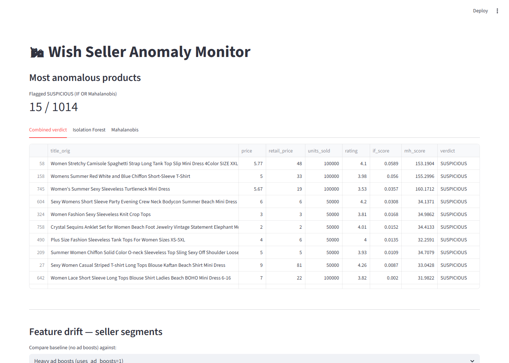

# wish-seller-anomaly

This is a small project I built to find sellers/products that "look wrong"
on an online marketplace. It uses unsupervised ML (no labels needed) on a
public Wish product dataset, and checks for things like: fake discounts,
review counts that don't match real sales, ads that don't bring any sales,
ratings that don't make sense, and merchants whose products suddenly do much
better than the merchant's own history.

## Why this matters (business value)

On marketplaces like Wish, Amazon, or AliExpress, fake discounts, fake
reviews, and bad sellers cost money and hurt user trust. A trust & safety
team can't check every single listing by hand, there are just too many. So
the real value here is not "find fraud with 100% accuracy" (no unsupervised
model can really promise that). It's about **making the review queue
smaller**. Instead of a person checking thousands of products one by one,
this pipeline gives them a short list of the ~1% most suspicious ones, plus
the reason each one got flagged, so a human can review them faster.

## How it works



I used two different detection methods on purpose, so I can check where they
agree. If Isolation Forest and Mahalanobis distance (which work in pretty
different ways) both flag the same product, that's a stronger signal than
just one of them flagging it alone. I go through this in more detail, with
real numbers, in `notebooks/01_eda.ipynb` — it also lists what this approach
can't do, which is worth reading before trusting the results too much.

## Dashboard



The dashboard shows the top flagged products (a combined verdict tab, plus
each detector on its own), and a drift panel (PSI) that compares different
seller segments — for example, "do sellers who use ad boosts look
statistically different from the rest of the catalog?"

## Engineered features

| Feature               | Signal                                                                                                      |
|------------------------|--------------------------------------------------------------------------------------------------------------|
| discount_rate          | Inflated retail price to fake a big discount                                                                 |
| review_to_sales_ratio  | Too many reviews compared to actual sales                                                                    |
| ad_efficiency          | Ad-boosted product that still sells poorly (rough proxy — the dataset only has a used/not-used flag, not real ad spend) |
| rating_quality         | 5-star rating backed by only a couple of reviews                                                             |
| merchant_trust_gap     | Product rated much better than the merchant's own track record                                               |

## How to run

```bash
make install && make train
make test         # unit tests, no side effects on trained models
make serve         # API   → localhost:8000/docs
make dashboard     # UI    → localhost:8501
```

Or with Docker (API only):
```bash
make build && make run
```

## Known limitations

There's no ground-truth "this seller is fraudulent" label anywhere in this
dataset, so nothing here is tested against real fraud outcomes. This model
gives you candidates for a human to check, not a final answer. The full list
of limitations (the contamination threshold was picked by hand, not fit;
`ad_efficiency` is only a rough proxy; drift monitoring is demoed on
synthetic splits, not real traffic; etc.) is written out in
`notebooks/01_eda.ipynb`.
